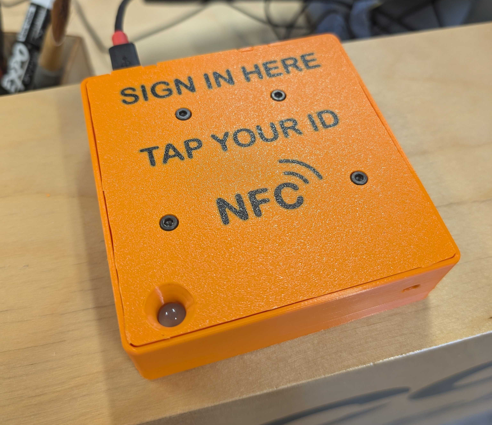

# ACS Tertiary Components

This page details ACS-compatible components that are used in more complex deployments beyond the standard Core-Switch setup. 

This page also includes diagnostics components used in testing and development.

# Sign-In Reader

The Sign-In Reader is a variant of the [ACS Core](ACS Core.md), that allows users to sign in to a space. ACS Cores can optionally be configured to not unlock if the user has not signed in to the space yet today. This can be used for statistics collection, as well as to ensure users speak to members of staff before starting to work. 

# Display

The display is an in-development part, that provides a screen for the ACS deployment. This can be used in lieu of the buzzer/speaker output of the ACS Core for deaf/HoH users or for noisy environments. It also allows persistent displays of information in the shop.

# Bypass Plug

The Bypass Plug allows for a Switch to be toggled without a Core, instead using a physical toggle switch to connect the Switch's 5v out to the ACS Signal line.
-
# Expansion Card

The Expansion Card allows for a single Core to connect to up to 3 downstream Switches or similar devices.

OneWire, RS485, abd ground, connections for the upstream and downstream components are all directly connected.

Power connections are all tied together, but through 500mA current-limiting circuitry. This means that one downstream device failing should not brownout the rest of the deployment.

The ACS signal from the upstream port is re-driven before being passed to the downstream ports, giving each Switch or similar a proper 20mA signal to work with.

The identifier pin is grounded, to indicate to the Core that the switch type cannot be determined.

# Logic Connector

The Logic Connector allows for 2 Cores to operate on the same deployment, combining their signals in one of 3 logical expressions;

* OR: Either of the Cores needs to be activated to activate the output. Disabling both Cores (lockout, power down, remove card, etc.) will disable the output.
* AND: Both Cores need to be activated to activate the output. Disabling either Core will disable the output. 
* AND/OR: Both Cores need to be activated to activate the output, but only one or the other is needed to maintain it on. Disabling both Cores will disable the output.

Both Cores are given a OneWire temperature sensor for verifying integrity, but only one of the Cores, designated the master by being plugged into the master Core connection, has all DE-9 connections wired to the downstream Switch. Switch identifier is grounded on the secondary Core. All other pins are not connected on the secondary Core.

The Logic Connector was developed for very complex equipment, like CNC machines, where we may be OK with a student running the machine but only once we've given the sign-off on their code and setup. In this situation, by giving the student access to the master Core and only staff access to the Secondary Core, students can only start the machine with a staff's help and then operate it without the staff having to be there constantly.
