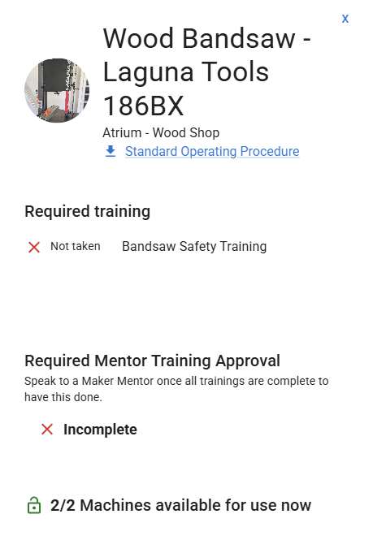

# User Quick Reference

This page has helpful reminders for makerspace users on the Access Control System.

Need more help? Ask a member of staff!

# Determining ACS State
Light on front of the device will indicate device state;

* **YELLOW SOLID**: Idle mode, ready to accept card.
* **YELLOW FLASHING**: Verifying inserted card, should be ready in a second.
* **RED**: Lockout or Fault, device unavailable for use.
* **GREEN**: Unlocked or Always On, device may already be in use (if card present) or unlocked for an event or similar (if no card present).
* **ANY OTHER COLOR**: System is in a diagnostic, update, or startup state. Please notify a member of staff for more help.

# Accessing a Device

* Check the state of the ACS Core, indicated by the light  
    * See "Determining ACS State" above for determining the state.
    * Only can/should continue if in "Idle" state.
* Insert your card until it hits the stop inside the ACS Core.
    * Card should be inserted >75% of the way.
    * Light should immediately change.
* If authorization granted: light will turn green and a "happy beep" will play.
    * You are now set to use the equipment!
    * Remove your card to end your session when complete.
* If authorization denied: light will turn red and a "sad beep" will play.
    * Speak to a staff member to figure out why you were denied
    * If you have used the equipment before, odds are you forgot to sign in today.
 
# Why can't I access this device?

* Did you remember to sign in today?
* Was the equipment in the Idle (Yellow light) state? If not it may be offline.
* Click "Equipment" on the left side of the screen.
* Find the piece of equipment you want to use and click on it.
* Check that all trainings are marked as taken, and that the Mentor Training Approval is complete.
 
